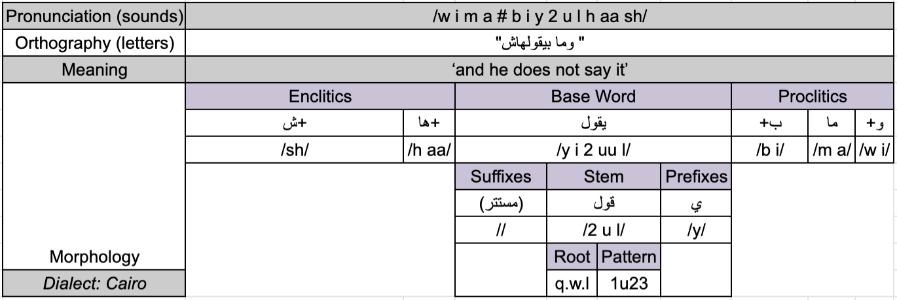
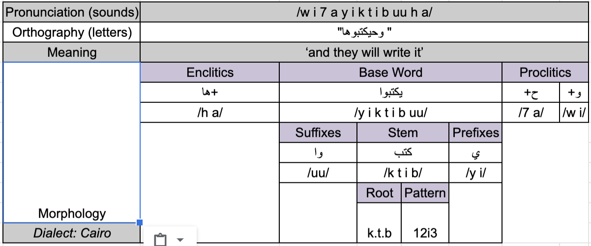

CODA*: Conventional Orthography for Dialectal Arabic
===

### CODA* Mission
* Dialectal Arabic (DA) refers to the day-to-day vernaculars spoken in the Arab world. DA lives side-by-side with the official language, Modern Standard Arabic (MSA). DA differs from MSA on all levels of linguistic representation, from phonology and morphology to lexicon and syntax. Unlike MSA, DA has no standard orthography since there are no Arabic dialect academies, nor is there a large edited body of dialectal literature that follows the same spelling standard.
* CODA* (pronounced CODA Star, as in, for any dialect) is a conventional orthography for dialectal Arabic. It is designed primarily for the purpose of developing computational models of Arabic dialects.

### CODA* Goals & Intentions
1. CODA* is an internally consistent and coherent convention for writing DA.
2. CODA* is created for computational purposes.
3. CODA* uses the Arabic script.
4. CODA* is a unified framework for writing all DAs.
5. CODA* aims to strike an optimal balance by maintaining a level of dialectal uniqueness yet establish conventions based on MSA-DA similarities.
6. CODA* strives to be easily learnable and readable.

### CODA Design Principles
1. CODA* is an ad hoc convention. There are numerous decisions that could have been made differently especially when it comes to the phonology/orthography interface. These principles make CODA* comparable to English spelling (a bit phonological, a bit historical, with some exceptions). In some cases, we followed decisions that have been made by previously published efforts.
2. CODA* uses only the inventory of Arabic script characters including the diacritics used for writing MSA. CODA* does not use extended Arabic characters, e.g. from Persian or Urdu. CODA* can be written undiacritized or diacritized.
3. Each DA word has a unique orthographic form in CODA that represents its phonology, morphology, and lexical semantics [meaning].
4. As a general rule, CODA* uses MSA-like orthographic decisions (rules, exceptions and ad hoc choices), e.g., cliticizing single letter particles, using Shadda for phonological gemination, using Ta-Marbuta, Alif Maqsura, silent Alif in Waw-Alif of plurality, and spelling the definite article Al morphemically. 
5. CODA* generally preserves the phonological form of dialectal words given the unique phonological rules of each dialect (e.g., vowel shortening), and the limitations of Arabic script (e.g., using a diacritic and a glide consonant to write a long vowel). Two important ad hoc exceptions pertain to specific root radical letters that happen to be highly variant across dialects, e.g. ق، ث، ذ، ظ، ج , etc. and to long pattern vowels that can be shortened deterministically in the dialects, e.g., the pattern 1awA2iy3 فواعيل. For these cases, the word is written using the MSA cognate root radicals or pattern.
6. CODA* preserves dialectal morphology (e.g., dialectal clitics حتقول instead of ستقول). The only exception here is separating the negation and indirect object pronouns although they are part of the word: e.g. (Cairo): ما قلت لهاش /m a # 2 u l t # i l h aa sh/ ‘I did not tell her’.
7. CODA* preserves dialectal syntax, i.e. there is no change in word order.
8. CODA* aims to be easy to learn and write, encouraging high inter-annotator agreement; the more CODA* looks like what a dialect speaker may write, the better.
9. CODA* rules are dialect independent.  (note that dialect-specific exception lists from previous CODA versions have been redesigned and unified into dialect independent sets of specific rules).
10. CODA* specific rules override general rules and apply to certain pre-defined classes of words – roughly corresponding to closed class or highly marking frequent words. The aim is to preserve important morphological information, maintain dialect integrity, and ensure overall readability.

### CODA* Rules

#### Introduction

CODA* (pronounced CODA Star, as in, for any dialect) is a conventional orthography for dialectal Arabic. It is designed primarily for the purpose of developing computational models of Arabic dialects. See CODA* Main Page for a description of CODA* mission statement and design guidelines.

Some sections of these guidelines are continously researched and updated as more dialectal data is incorporated.

(CODA* version: 0.43)

#### Basic Terminology

##### Sounds - Letters - Diacritics

The term sounds is used in the context of pronunciation (phonology), while letters and diacritics are used in the context of writing (orthography). Sounds can be consonants or vowels, and they are represented using the CAPHI representation (see Phonology Reference) and are bounded by forward slashes when necessary. Letters and diacritics are symbols used in the Arabic script to write words. Letters in the Arabic language are always required to be written; while diacritics are optional.

The space for consonants and vowels is shared by letters and diacritics, neither of which is exclusive to either category of symbols. To understand this shared space, keep in mind the following:

***

Letters can be used to write:
 * Consonants - /b/, written "ب"; /y/, written "ي", i.e: /b aa b/, باب, 'door'; or /y i k t u b/, يكتب, 'he writes'
 * Vowels - /i/, written "ي", i.e: /k i t aa b i/, كتابي, 'my book'

***

Diacritics can be used to specify:
* No vowel - “ ْ ” (Sukuun), i.e: /k a l b/, كلْب, 'dog'
* Double consonants - “ ّ ”ّ, (Shadda), i.e: /k a s s a r/, كسّر, 'he broke'
* Vowels - “ َ ” (Fatha), i.e: /k a t a b/, كَتَب, 'he wrote'
* Vowels+consonants - “ ً ”, /a n/, (Nunation), i.e: /f i 3 l a n/, فعلاً, 'verily'

#### Basic Terminology

##### Patterns - Other Morphemes

Arabic’s templatic morphology makes common reference to the concept of the root, a typically tri-consonantal abstraction capturing a general meaning about the word. For example, the root ك.ت.ب 'writing-related' appears in words like مكتب 'office' and كتاب 'book'. Each sound in the root is referred to as a radical. The general complement of the root is the pattern, which in the examples above are ma12a3 and 1i2A3 (here, 1, 2, 3 are slots for the root radicals). In addition to the root and pattern templatic morphemes, Arabic uses numerous other concatenative morphemes.

#### Basic Terminology

##### Words - Base Words - Clitics

We define an Arabic base word to consist of a stem and the minimal number of concatenative affixes needed to specify the obligatory features for its part of speech (POS). A stem can be non-templatic or it can be composed from the interdigitation of a root and a pattern. The pattern may specify the features fully, as in broken plurals. Base words are as such the smallest fully formed words. Examples include: كتابين 'two books' and يكتبون 'they write'. Clitics are syntactically independent but phonologically dependent morphemes that are attached to the word phonologically. Words can be base words or base words with added clitics. We use the term word to refer to the phonological utterance or the orthographic string, and we specify as needed. In CODA, phonological words typically map one-to-one to orthographic words; but there are many exceptions, pertaining mostly to clitics that are spelled as separate orthographic words.

***

#### General

##### Basic Phonology to Orthography Mapping

###### Hamza Rules

Hamza (Glottal Stop) spelling follows from the same rules as those of MSA and is unchanged from previous CODA versions. 

(For a detailed explanation of Hamza spelling rules in MSA, you can refer to chapter 7 of the [QALB annotation guidelines](http://nlp.qatar.cmu.edu/qalb/QALB-guidelines_0.90.pdf))

***

Note on **base word initial Hamza**: In previous versions of CODA, and in MSA spelling, base word initial Hamza have complex spelling rules. The rule is now simplified to normalize and not spell base word initial Hamzas, though the option remains to considers the Hamzation (أ, إ) at the beginning of a word as optional

***

Note on **word initial Madda**: any word that starts with a long vowel of the quality /2 aa/ is spelled with a Madda آ

***

Note on **DA divergence from MSA cognates**: Hamza spelling matches the sound. In other words, dialectal words that have MSA cognates containing Hamza but do not contain an /2/ in their phonology are spelled without the Hamza.

| CODA                             | CAPHI                | Gloss                    | MSA Cognate     | e.g Dialect | Examples; Comments                                                                                       | 
|----------------------------------|----------------------|--------------------------|-----------------|-------------|----------------------------------------------------------------------------------------------------------| 
| الف       | 2_a_l_f              | thousand                 | ألف             | Sanaa       | Base word initial Hamza is normalized (not written)                                                      | 
| مألوف     | m_a_2_l_uu_f         | familiar                 | مألوف           | Sanaa       |                                                                                                          | 
| لا مؤاخذة | l_a_#_m_u_2_a_kh_z_a | excuse me                | لا مؤاخذة       | Cairo       |                                                                                                          | 
| فئة       | f_i_2_e              | denomination             | فئة             | Sanaa       |                                                                                                          | 
| يأنتر     | y_i_2_a_n_t_i_r      | he is using the internet | يستعمل الإنترنت | Sanaa       |                                                                                                          | 
| بريء      | b_a_r_ii_2           | innocent                 | بريء            | Sanaa       |                                                                                                          | 
| بير       | b_ii_r               | well                     | بئر             | Sanaa       | Spelling follows dialect phonology: Hamza is dropped                                                     | 
| سما       | s_a_m_e              | sky                      | سماء            | Sanaa       | Hamza is dropped from dialect, but final vowel spelling maintains the Alif taking etymology into account | 
| ما        | m_aa                 | water                    | ماء             | ِAlgiers    | Hamza is dropped from, but final vowel spelling maintains the Alif taking etymology into account         | 
| آسف       | 2_aa_s_i_f           | sorry                    | آسف             | Sanaa       | Madda rule                                                                                               | 
| تأمين     | t_e_2_m_ii_n         | insurance                | تأمين           | Beirut      |                                                                                                          | 

#### General

##### Basic Phonology to Orthography Mapping

###### Diacritics

While Arabic diacritics are optional in general, they can be crucial for disambiguation in certain contexts. Arabic diacritics are primarily used for representing short vowels, or absence of vowels. However, the Shadda diacritic is used to represent consonantal gemination, e.g. كَتَّب /k a t t a b/ ‘he dictated’. As such, the Shadda interacts with the number of letters in a word. The Shadda general rule states that it is used within the base word (including suffixes and prefixes), but not across word-clitic boundaries. Any exceptions must be specified in the specific rules (see specific rule: "The Definite Article" for an example of where the general Shadda rule is overriden.

| CODA                             | CAPHI                  | Gloss                  | Tokenized CODA | e.g Dialect | NON-CODA examples; Comments                                                                                  | 
|----------------------------------|------------------------|------------------------|----------------|-------------|--------------------------------------------------------------------------------------------------------------| 
| جنَّنَاهم | g_a_n_n_a_n_n_aa_h_u_m | we made them crazy     | جنننا+هم       | Cairo       | Note that this نا  is an obligatory suffix referring to the verbal feature [1p] and is part of the base word | 
| جنَّنَنا  | g_a_n_n_a_n_n_a        | he/it mad us crazy     | جنَن+نا        | Cairo       |                                                                                                              | 
| يبارككم   | b_aa_r_i_k_k_u_m       | [he] congratulates you | يبارك+كم       | Cairo       |                                                                                                              | 
| واحشيننا  | w_aa_7_sh_i_n_n_a      | we miss you            | واحشين+نا      | Cairo       |                                                                                                              | 

#### General

##### Basic Phonology to Orthography Mapping

###### Long/Short Vowel Spelling

In many dialects, base word long vowels may be shortened in certain contexts. Generally, the rule is to prefer the long letter-based spelling over the shortened diacritic spelling.

| CODA                            | CAPHI          | Gloss         | MSA Cognate | e.g Dialect | Examples; Comments                                                                                  | 
|---------------------------------|----------------|---------------|-------------|-------------|-----------------------------------------------------------------------------------------------------| 
| قانون    | 2_a_n_uu_n     | law           | قانون       | Cairo       | So long as the vowel is the same quality as the MSA, we can keep the MSA spelling                   | 
| قولوا له | 2_u_l_uu_#_l_u | tell him [2p] | قولوا له    | Cairo       | this is because قول is not always short in Cairene and can be pronounced long in different contexts | 

#### General

##### Basic Phonology to Orthography Mapping

###### Root Radical Spelling

Dialectal word root radicals which have MSA cognates will be spelled using the MSA cognate radical if the dialectal radical sound and the MSA radical sounds are paired according to a specific set of common sound changes.

Our list of allowed pairings is presented in the table below:

| CODA | Dialectal Sound Variant(s) | MSA Sound | 
|------|----------------------------|-----------| 
| ت    | t., d, d.                  | t         | 
| ث    | t, t., s                   | th        | 
| ج    | j, tsh, gy, y              | dj, g     | 
| د    | t., d.                     | d         | 
| ذ    | d, dh., z                  | dh        | 
| ر    | gh                         | r         | 
| ز    | s, s.                      | z         | 
| س    | s., z                      | s         | 
| ش    | tsh                        | sh        | 
| ص    | s, z                       | s.        | 
| ض    | d, dh., z.                 | d.        | 
| ط    | t                          | t.        | 
| ظ    | d., z.                     | dh.       | 
| ق    | j, dz, dj, k, g, qh, 2     | q         | 
| ك    | ts, tsh, g                 | k         | 
| ن    | m                          | n         | 

***
<!--     

  more examples
  
 -->

| CODA                          | CAPHI            | Gloss           | CODA Letter | Dialectal Sound | MSA Sound | e.g Dialect  | NON-CODA examples; Comments                                                                                                                                                                                      | 
|-------------------------------|------------------|-----------------|-------------|-----------------|-----------|--------------|------------------------------------------------------------------------------------------------------------------------------------------------------------------------------------------------------------------| 
| برتقان | b_u_r_t_u_2_aa_n | orange          | ق           | 2               | q         | Jeddah       | برتئان، برتقال; only the sound-letter pairs that are in the list of permitted changes are changed                                                                                                                | 
| ثامن   | t_aa_m_i_n       | eighth          | ث           | t               | th        | Jeddah       | تامن                                                                                                                                                                                                             | 
| فستان  | f_u_s_t._aa_n    | dress           | ت           | t.              | t         | Amman        | فسطان، فصطان                                                                                                                                                                                                     | 
| ذيل    | d_ee_l           | tail            | ذ           | d               | dh        | Beirut       | ديل                                                                                                                                                                                                              | 
| ضحك    | d_i_7_i_k        | he laughed      | ض           | d               | d.        | Cairo        | دحك                                                                                                                                                                                                              | 
| ضفدعة  | d._u_f_d._a_3_a  | frog            | د           | d.              | d         | Cairo        | ضفضعة                                                                                                                                                                                                            | 
| ظهرية  | d._u_h_r_i_y_y_a | shaddow         | ظ           | d.              | dh.       | Jeddah       | ضهرية                                                                                                                                                                                                            | 
| ذوق    | dh._oo_g         | tasting         | ذ           | dh.             | dh        | Baghdad      | ظوق                                                                                                                                                                                                              | 
| ضغط    | dh._a_gh_a_t.    | he pressed      | ض           | dh.             | d.        | Jerusalem    | ظغط                                                                                                                                                                                                              | 
| ثورة   | s_a_w_r_a        | revolution      | ث           | s               | th        | Cairo        | سورة                                                                                                                                                                                                             | 
| الزعيم | 2_a_s_s_e_3_ii_m | the boss        | ز           | s               | z         | Sana’a       | السعيم                                                                                                                                                                                                           | 
| صايغ   | s_aa_y_e_gh      | jeweler         | ص           | s               | s.        | Cairo        | سايغ                                                                                                                                                                                                             | 
| سلطة   | s._a_l._a_t._a   | salad           | س           | s.              | s         | Khartoum     | صلطة                                                                                                                                                                                                             | 
| ذبيحة  | z_a_b_ii_7_a     | meat            | ذ           | z               | dh        | Muscat       | زبيحة                                                                                                                                                                                                            | 
| اسبوع  | 2_i_z_b_uu_3     | week            | س           | z               | s         | Khartoum     | ازبوع                                                                                                                                                                                                            | 
| صغير   | z_gh_ii_r        | small           | ص           | z               | s.        | Beirut       | زغير                                                                                                                                                                                                             | 
| مضبوط  | m_a_z._b_uu_t.   | correct         | ض           | z.              | d.        | Jeddah       | مزبوط                                                                                                                                                                                                            | 
| عظيم   | 3_a_z._ii_m      | great           | ظ           | z.              | dh.       | Damascus     | عزيم                                                                                                                                                                                                             | 
| طريق   | t._a_r_ii_j      | road            | ق           | j               | q         | Baghdad      | طريج                                                                                                                                                                                                             | 
| سمك    | s_i_m_a_ts       | fish            | ك           | ts              | k         | Riyadh(B)    | سمتس                                                                                                                                                                                                             | 
| كتابج  | k_i_t_aa_b_i_ts  | your [2fs] book | ج           | ts              | dj, g     | Riyadh(B)    | كتابتس، كتابك; Remember that root radicals only apply to the root of the base word, and that clitics such as the possessive pronoun ج+ may have their own rules (see specification tables)                       | 
| جزاير  | dz_aa_y_i_r      | Algeria         | ج           | dz              | dj, g     | Algiers      | دزاير                                                                                                                                                                                                            | 
| طريق   | t._a_r_ii_dz     | road            | ق           | dz              | q         | Baghdad      | طريدز                                                                                                                                                                                                            | 
| عيونج  | 3_y_uu_n_i_tsh   | your eyes [2fs] | ج           | tsh             | dj, g     | Doha         | عيونش، عيونتس; Remember that root radicals only apply to the root of the base word, and that clitics such as the possessive pronoun ج+ may have their own rules (see specification tables)                       | 
| شاف    | tsh_aa_f         | he saw          | ش           | tsh             | sh        | Doha         | تشاف                                                                                                                                                                                                             | 
| سمك    | s_i_m_a_tsh      | fish            | ك           | tsh             | k         | Riyadh(B)    | سمج، سمتش                                                                                                                                                                                                        | 
| طريق   | t._i_r_ii_dj     | road            | ق           | dj              | q         | Baghdad      | طريج                                                                                                                                                                                                             | 
| رقم    | r_a_k_a_m        | number          | ق           | k               | q         | Jerusalem(R) | ركم                                                                                                                                                                                                              | 
| قال    | g_aa_l           | he said         | ق           | g               | q         | Aswan        | جال، كال                                                                                                                                                                                                         | 
| بنك    | b._a_n_g         | bank            | ك           | g               | k         | Baghdad      | بنج، بنق                                                                                                                                                                                                         | 
| رقم    | r_a_qh_a_m       | number          | ق           | qh              | q         | Jerusalem(R) | رغم، رجم                                                                                                                                                                                                         | 
| غسالة  | kh_a_s_s_ee_l_a  | washer          | غ           | kh              | gh        | Tunis        | خسالة; while there is no /kh/ to غ mapping in the root radical cognate table, this switch is allowed in this particualr case because Tunisian use of /kh a s s ee l a/ and /gh a s s ee l a/ is in free variance | 
| اريد   | 2_a_gh_ii_d      | I want          | ر           | gh              | r         | Mosul        | اغيد                                                                                                                                                                                                             | 
| طريق   | t._a_r_ii_2      | road            | ق           | 2               | q         | Baghdad      | طريء                                                                                                                                                                                                             | 
| جنب    | j_a_m_b          | besides         | ن           | m               | n         | Jeddah       | جمب                                                                                                                                                                                                              | 
| جلس    | y_a_l_a_s        | he sat down     | ج           | y               | dj, g     | Abu Dhabi    | يلس                                                                                                                                                                                                              | 

  <!-- 
 -->

#### General

##### Base Word Spelling

###### Pattern Spelling

Dialectal words with patterns that are cognates of MSA patterns will retain the spelling choice of the MSA pattern if the difference in pronunciation can be expressed using diacritics (for vowel change or absence), or if the pronunciation is a shortened form of the MSA pattern vowels.

| Example in CODA               | Example in CAPHI    | Gloss          | CODA Letter | Dialectal Sound | MSA Sound | e.g Dialect | NON-CODA examples; Comments | 
|-------------------------------|---------------------|----------------|-------------|-----------------|-----------|-------------|-----------------------------| 
| اتضرب  | 2_i_d._d._a_r_a_b   | he got hit     | ت           | d.              | t         | Cairo       | ادضرب، اضّرب                | 
| اتدشدش | 2_i_d_d_a_sh_d_a_sh | he got smashed | ت           | d               | t         | Cairo       | ادّشدش                      | 

#### General

##### Base Word Spelling

###### Alif Maqsura

The MSA rules for spelling the Alif-Maqsura (ى), which are sometimes based on roots and sometimes on patterns, apply in CODA*.

| CODA                        | CAPHI      | Gloss      | e.g Dialect | NON-CODA examples; Comments | 
|-----------------------------|------------|------------|-------------|-----------------------------| 
| اعطى | 2_a_3_t._a | give [3ms] | Abu Dhabi   | اعطا                        | 
| بغى  | b_gh_a     | want [3ms] | Rabat       | بغا                         | 
| حكى  | 7_a_k_e    | chat [3ms] | Beirut      | حكي                         | 

#### General

##### Base Word Spelling

###### Clitic Spelling

The general rule on phonological clitic spelling is that clitics that are mapped into single letters (with possible diacritics) will be spelled attached to the word, and will not interact with the spelling of the word. (For examples of specifc rules that override this rule, see "The Definite Article" and "Nominative Pronouns")

| CODA                               | CAPHI                          | Gloss                 | Tokenized CODA | e.g Dialect | /Comments                                                                                      | 
|------------------------------------|--------------------------------|-----------------------|----------------|-------------|------------------------------------------------------------------------------------------------| 
| ولحد ما يجي | w_l_a_7_a_d_d_#_m_a_#_y_ii_g_i | and until he/it comes | و+ل+حد ما يجي  | Cairo       | notice how و and ل -- single letter clitics -- attach to adjacent morphemes while ما does not. | 

#### Specific Rules

##### The Definite Article

The Arabic definite article is always written as a proclitic ال+ـ, regardless of how it is pronounced (keep in mind that in DA, lunar/solar letters are not always the same as in MSA). As with MSA spelling, general cliticization rules apply except when following the proclitic ل+ـ, where the article is spelled without its ا. The general Shadda rule is overridden in the specific context of ل+ ال+ـ followed by an ل-initial base word.

| CODA                           | CAPHI             | Gloss             | Tokenized CODA | e.g Dialect | Examples; Comments                                                                                             | 
|--------------------------------|-------------------|-------------------|----------------|-------------|----------------------------------------------------------------------------------------------------------------| 
| القمر   | 2_i_l_2_a_m_a_r   | the moon          | ال+قمر         | Cairo       |                                                                                                                | 
| الشمس   | 2_i_sh_sh_a_m_e_s | the sun           | ال+شمس         | Jerusalem   |                                                                                                                | 
| الكتاب  | 2_i_k_k_i_t_aa_b  | the book          | ال+كتاب        | Cairo       | Note how Cairene sometimes treats /k/ as a solar letter                                                        | 
| البيت   | l_b_ee_t          | the house         | ال+بيت         | Jerusalem   |                                                                                                                | 
| البيوت  | l_e_b_y_uu_t      | the houses        | ال+بيوت        | Jerusalem   |                                                                                                                | 
| بالبيت  | b_e_l_b_ee_t      | at home           | ب+ال+بيت       | Jerusalem   |                                                                                                                | 
| بالبيوت | b_l_e_b_y_uu_t    | at the houses     | ب+ال+بيوت      | Jerusalem   |                                                                                                                | 
| للبيت   | l_a_l_b_ee_t      | for the house     | ل+ال+بيت       | Jerusalem   |                                                                                                                | 
| للبيوت  | l_a_l_e_b_y_uu_t  | for the houses    | ل+ال+بيوت      | Jerusalem   |                                                                                                                | 
| للشمس   | l_a_sh_sh_a_m_e_s | to the sun        | ل+ال+شمس       | Jerusalem   |                                                                                                                | 
| للشموس  | l_a_l_e_sh_m_uu_s | to the suns       | ل+ال+شومس      | Jerusalem   |                                                                                                                | 
| اللجنة  | 2_e_l_l_a_g_n_a   | the committee     | ال+لجنة        | Cairo       |                                                                                                                | 
| للجنة   | l_e_l_l_a_g_n_a   | for the committee | ل+ال+لجنة      | Cairo       | Note how it is not spelled لللجنة and the general shadda rules are overriden (see general "Diacritics" rules). | 

#### Specific Rules

##### The Ta-Marbuta

The Ta-Marbuta (ة) is a secondary letter of the Arabic alphabet used to represent a particular suffix morpheme that is often (but not exclusively) associated with the feminine-singular feature (Alkuhlani and Habash, 2011). This morpheme has a number of allomorphs with differing pronunciations. Most notably, it appears as a vowel at the end of nominals, and changes to a ∼ /t/ when followed by possessive pronominal enclitics. The Ta-Marbuta should be written as ة in word-final positions, regardless of its pronunciation, and following general CODA rules in non-word-final positions.

| CODA                               | CAPHI                         | Gloss               | e.g Dialect | 
|------------------------------------|-------------------------------|---------------------|-------------| 
| حاجة        | 7_aa_g_a                      | something           | Cairo       | 
| حاجتي       | 7_aa_g_t_i_                   | my thing            | Cairo       | 
| حاجتها      | 7_aa_g_i_t_h_a                | her thing           | Cairo       | 
| طاولة       | t._aa_w_l_e                   | table               | Jerusalem   | 
| غزالة       | gh_a_z_ee_l_i                 | gazelle             | Beirut      | 
| معلمة مدرسة | m_3_a_l_m_i_t_#_m_a_d_r_a_s_e | school teacher      | Jerusalem   | 
| معلمة مدرسة | m_3_a_l_m_e_#_m_a_d_r_a_s_e   | she taught a school | Jerusalem   | 
| معلمتهم     | m_3_a_l_m_i_t_h_u_m           | their teacher       | Jerusalem   | 
| معلماهم     | m_3_a_l_m_aa_h_u_m            | she taught them     | Jerusalem   | 

#### Specific Rules

##### The Plural Waw

Verbal suffixes that indicate the feature plural subject [2p] & [3p] and end with the sounds (/u/, /uu/, /o/, /oo/, and /aw/) will represent those sounds as وا+ (‘Waw of Plurality’ واو الجماعة) in word-final positions, and also when followed by other attached clitics. This rule is similar to the MSA rule, except for expanding the phonetic definition.

| CODA                            | CAPHI             | Gloss            | e.g Dialect | 
|---------------------------------|-------------------|------------------|-------------| 
| قالوا    | 2_aa_l_u          | they said        | Cairo       | 
| بيقولوا  | b_i_y_2_uu_l_u    | they say         | Cairo       | 
| نقولوا   | n_q_uu_l_u        | we say           | Tunis       | 
| قالوا    | g_aa_l_a_w        | they said        | Abu Dhabi   | 
| قالوها   | 2_a_l_uu_h_a      | they said it     | Cairo       | 
| ما قالوش | m_a_#_2_a_l_uu_sh | they did not say | Cairo       | 
| قالوا له | 2_a_l_uu_#_l_u    | they said to him | Cairo       | 

 

#### Specific Rules

##### Negation Clitics

The negation particle (/m a/, /m aa/) has phonologically become a proclitic in many dialects. However, it is always written as a separate particle ما except when overridden by other specification rules. One example of such a rule is the case of negated pronouns (see "Nominative Pronouns"), in which ما is written attached. Another example involves some negated existentials (see "Existentials") in which the Alif can be ellided.

| CODA                            | CAPHI                 | Gloss          | e.g Dialect | 
|---------------------------------|-----------------------|----------------|-------------| 
| ما قال   | m_aa_#_2_aa_l         | he did not say | Damascus    | 
| ما قالش  | m_a_#_2_a_l_sh        | he did not say | Cairo       | 
| ما بدناش | m_a_#_b_i_d_d_n_aa_sh | we do not want | Amman       | 
| مانيش    | m_a_n_ii_sh           | I am not       | Cairo       | 
| ماهياش   | m_a_h_i_y_y_aa_sh     | she is not     | Cairo       | 

#### Specific Rules

##### Prepositional Enclitics

Post-verbal and post-nominal prepositions that have phonologically become enclitics will nonetheless be spelled separately from the words they follow. The most prominent such case is the preposition ل+ـ ‘to, for’ which introduces indirect verb objects in a number of dialects.

| CODA                                | CAPHI                   | Gloss                     | e.g Dialect | 
|-------------------------------------|-------------------------|---------------------------|-------------| 
| قالوها لي    | 2_a_l_u_h_aa_#_l_i      | they said it to me        | Cairo       | 
| ما قالوا ليش | m_a_#_2_a_l_u_#_l_ii_sh | they did not say it to me | Cairo       | 
| بالنسبة له   | b_i_n_n_i_s_b_aa_#_l_u  | as for him                | Cairo       | 

#### Specific Rules

##### Numbers

The words for numbers in Arabic dialects are amongst the most rich in phonological variety. The rules of writing number words in CODA* add the following exceptions to the general rules:
* The sometimes reduced historical Ta-Marbuta in the middle of the teens (11-19) is always written as ت regardless of its pronunciation as /t/ or /t./. It is never reduced to a Shadda diacritic.
* The sometimes reduced historical /3/ ع in numbers such as عشر ‘ten, -teen’, and تسع ‘nine’ will always be spelled as ع even if completely elided or turned into a vowel.
* The sometimes reduced or altered final letter of عشر ‘ten, -teen’ will be written as pronounced. The variation in this form marks different syntactic construction in some dialects.
* The hundreds will be written as a single word only if the hundred part is singular in form.
* The remnant /t/ of the historical Ta-Marbuta appearing only before Alif-initial words after number words will not be written.

The above rules apply to all number words, whether ordinal, cardinal, or fractions. Number words sometimes have different masculine and feminine forms that are used according to different dialect-specific rules. CODA guidelines do not interact with these dialect-specific decisions.

| CODA                             | CAPHI                     | Gloss        | e.g Dialect | 
|----------------------------------|---------------------------|--------------|-------------| 
| ثمانية    | th_a_m_a_n_y_e            | eight        | Salt        | 
| ثمانية    | t_a_m_a_n_y_e             | eight        | Amman       | 
| ثمانة     | t_a_m_aa_n_e              | eight        | Damascus    | 
| ثمان      | t_a_m_a_n                 | eight X      | Amman       | 
| ثمان      | t_m_aa_n                  | eight X      | Damascus    | 
| ثمانتعش   | t_a_m_a_n_t_a_3_sh        | eighteen     | Amman       | 
| ثمانتعش   | t_m_a_n_t_a_3_sh          | eighteen     | Damascus    | 
| ثمنتعش    | th_m_u_n_t._a_3_i_sh      | eighteen     | Baghdad     | 
| ثمانتعشر  | t_a_m_a_n_t_aa_sh_a_r     | eighteen     | Cairo       | 
| ثمانتعشر  | t_a_m_a_n_t_a_3_sh_a_r    | eighteen X   | Amman       | 
| ثمانتعشن  | th_m_a_n_t._aa_sh_e_n     | eighteen X   | Tunis       | 
| اربعمية   | 2_a_r_b_a_3_m_i_y_y_e     | 400          | Amman       | 
| اربعمية   | 2_a_r_b_a_3_m_ii_t        | 400 X        | Amman       | 
| ربعمية    | r_u_b_3_u_m_i_y_y_a       | 400          | Cairo       | 
| اربع الاف | 2_a_r_b_a_3_#_t_a_l_aa_f  | 4,000        | Cairo       | 
| خمس ارباع | kh_a_m_a_s_#_t_i_r_b_aa_3 | five-fourths | Cairo       | 

#### Specific Rules

##### Pronominal Enclitics

The set of specifications for the pronominal clitics which can serve as possessive pronouns. Some of the decisions follow from the general rules, but for the most part they are intended to normalize the spelling as close as possible to the MSA variety without adding unnecessary and unresolvable ambiguity (e.g., using diacritics). It is important to point out again that this list is not dialect specific, but rather, it lists all the phonological forms of the pronominal morphemes in all dialects. The CODA* spelling for a dialect will depend on the phonology-morphology pair it corresponds to. Some of these pronouns have a large number of variants that can be ambiguous cross-dialectally. An interesting example is the case of the morpheme pronunciation /a/ which can be 3rd masculine singular in Gulf Arabic, but 3rd feminine singular in North Levantine: /k t aa b + a/ can correspond to كتاب+ه ‘his book’ (Abu Dhabi) or to كتاب+ها ‘her book’ (Damascus). The CODA* specification does not address how a particular dialect may organize the use of the different forms in terms of morphotactics, e.g., the possessive 2nd person singular feminine pronominal clitic is always ك+ in Tunis, and always كي+ in Mosul; however, in Amman, it is كي+ post-vocalically, and ك+ otherwise. The underspecification of some features is intentional as some pronominal clitics may be used with different associated genders in different dialects, e.g. كن+ is 2nd person plural feminine in Doha, but its is gender ambiguous in Beirut.

*** 

Here is the specification table for Pronominal Clitics:

| CODA | CAPHI                             | Morpheme Features             | 
|------|-----------------------------------|-------------------------------| 
| ني   | n_i, n_e, n_ii, n_ee              | 1st Person Singular           | 
| ي    | i, ii, e, ee, y, y_a, y_e         | 1st Person Singular           | 
| ك    | k, i_k, e_k, k_a                  | 2nd Person Singular           | 
| كي   | k_i, k_e, k_ii, k_ee              | 2nd Person Singular Feminine  | 
| ج    | tsh, i_tsh, ts, i_ts              | 2nd Person Singular Feminine  | 
| ه    | h, h_u, u, o, a, a_h, u_h, length | 3rd Person Singular Masculine | 
| ها   | h_a, h_aa, a, aa, h_e, h_ee       | 3rd Person Singular Feminine  | 
| نا   | n_a, n_aa, n_e, n_ee              | 1st Person Plural             | 
| كم   | k_u_m, k_o_m                      | 2nd Person Plural             | 
| كن   | k_u_n, k_o_n, tsh_i_n             | 2nd Person Plural             | 
| هم   | h_u_m, h_o_m, u_m, o_m            | 3rd Person Plural             | 
| هن   | h_u_n, h_o_n, u_n, o_n            | 3rd Person Plural             | 

*** 

| CODA                          | CAPHI        | Gloss    | e.g Dialect | 
|-------------------------------|--------------|----------|-------------| 
| كتابها | k_i_t_aa_b_a | her book | Damascus    | 
| كتابه  | k_i_t_aa_b_a | his book | Abu Dhabi   | 

#### Specific Rules

##### Nominative Pronouns

Nominative Pronouns are spelled as pronounced using general phonolgical rules, except for the final vowels, which are spelled in two different ways:
* (a) as diacritical forms if (i) the vowel is short and (ii) the spelling of the undiacritized base word exactly matches the MSA form for هو، هي، هم، هن and انتَ [masculine singular].
* Else (b) as letter form (ا، و، ي) regardless of their length: احنا or انتو.
Decision notes:
* انتي - as in /2 i n t i/, ‘you [fs]’ is spelled with the final “ي” always to reflect its common usage - and distinguish it from the undiacratized form of انت.
* نحنا - as in /n i 7 n a/, ‘we’ is spelled with a final “ا” and not as نِحْنَ because the MSA form is perceived to be highly associated with the final vowel /u/ - /n a 7 n u/.
* The rule treats هو، هي، هم، هن exceptionally because adding additional letters used for vowel marking (ا،و،ي،ه) can cause added ambiguity: هوا، هما،هيا
* The Lebanese Arabic /h u w w i/, ‘he’ is spelled as هُوِّ as the final vowel /i/ is a short vowel and as such it follows from Rule Part (a).
* Negated pronouns may become a single word when negated using a circumfix negation, e.g. /m a n ii sh/ “مانيش”.
    * Multiples of Alif: In the cases of negation particles ending with “ا” attaching to pronouns starting with “ا”, only one “ا” should remain, e.g. /m a 7 n aa sh/ → ماحناش → ما+احنا+ش.

| CODA                        | CAPHI     | Gloss     | e.g Dialect | 
|-----------------------------|-----------|-----------|-------------| 
| احنا | 2_i_7_n_a | we        | Cairo       | 
| انا  | 2_a_n_a   | I         | Cairo       | 
| انت  | 2_i_n_t_a | you [2m]  | Cairo       | 
| انتو | 2_i_n_t_u | you [2p]  | Cairo       | 
| انتي | 2_i_n_t_i | you [2fs] | Cairo       | 
| اني  | 2_a_n_i   | I         | Tripoli     | 
| نحنا | n_i_7_n_a | we        | Cairo       | 
| هم   | h_u_m_m_a | they      | Cairo       | 
| هو   | h_u_w_w_a | he, it    | Cairo       | 
| هي   | h_i_y_y_a | she, it   | Cairo       | 

***

| CODA                          | CAPHI             | Gloss                 | Tokenized CODA | e.g Dialect | 
|-------------------------------|-------------------|-----------------------|----------------|-------------| 
| ماحناش | m_a_7_n_aa_sh     | we are not            | ما+احنا+ش      | Cairo       | 
| مانتاش | m_a_n_t_aa_sh     | you are not           | ما+انت+ش       | Cairo       | 
| مانتوش | m_a_n_t_uu_sh     | you are not           | ما+انتو+ش      | Cairo       | 
| مانتيش | m_a_n_t_ii_sh     | you are not           | ما+انتي+ش      | Cairo       | 
| مانيش  | m_a_n_ii_sh       | I am not              | ما+اني+ش       | Cairo       | 
| ماهماش | m_a_h_u_m_m_aa_sh | they are not          | ما+هم+ش        | Cairo       | 
| ماهواش | m_a_h_u_w_w_aa_sh | he is not, it is not  | ما+هو+ش        | Cairo       | 
| ماهياش | m_a_h_i_y_y_aa_sh | she is not, it is not | ما+هي+ش        | Cairo       | 

#### Specific Rules

##### Vocative Familial Expressions

Some of the vocative expressions used primarily for familial reference have vocalic endings that are homophonous with pronominal suffixes. These endings are spelled following the general phonology-to-orthography rules. For example, the word /3 a m m o/ in the dialect of Amman can mean ‘uncle!’ (spelled in CODA as عمو) or ‘his uncle’ (spelled in CODA as عمه).

| CODA                       | CAPHI     | Gloss     | e.g Dialect | 
|----------------------------|-----------|-----------|-------------| 
| عمو | 3_a_m_m_o | uncle!    | Amman       | 
| عمه | 3_a_m_m_o | his uncle | Amman       | 

#### Specific Rules

##### Relative Pronouns

Some forms containing relative pronouns can have different spelling rules, primarily to disambiguate differences in meaning.

| CODA                           | CAPHI     | Gloss            | e.g Dialect                                                                | Examples; Comments                                                                                                                                               | 
|--------------------------------|-----------|------------------|----------------------------------------------------------------------------|------------------------------------------------------------------------------------------------------------------------------------------------------------------| 
| اللي    | 2_i_l_l_i | who, which, whom | Cairo, Abu Dhabi, Rabat, Tunis, Beirut, Riyadh, Damascus, Jerusalem, Sanaa | Follows general spelling rules                                                                                                                                   | 
| يا اللي | y_a_l_l_i | O you who..      | Cairo, Jerusalem, Riyadh, Sanaa, Abu Dhabi                                 | Following general rules, the vocative morpheme يا is spelled separately connoting a vocative expression                                                          | 
| يا اللي | y_e_l_l_i | O you who..      | Tunis                                                                      | Following general rules, the vocative morpheme يا is spelled separately connoting a vocative expression                                                          | 
| ياللي   | y_a_l_l_i | who, which, whom | Beirut, Damascus, Jerusalem                                                | هو ياللي اخترته; Note from the meaning how this is not a vocative expression, and the يا is simply a part of the relative pronoun in some dialects of the Levant | 
| لاللي   | l_i_l_l_i | to whom..        | Riyadh, Sanaa                                                              | Following general cliticization rules, the ل prepositional clitic attaches to the relative pronoun without changing its spelling                                 | 

#### Specific Rules

##### Waqt/Sa3a forms

Some forms related to time, such as the Cairene /d i l w a 2 t i/, دلوقتي, 'now', are frozen forms which etymologically transform and combine various morphemes, in this case: هذا + الوقت. Instead of spelling it phonologically دلوئتي, we preserve etymological information by considering the nominal part of the word and spelling it according to general root radical cognate rules.

| CODA                          | CAPHI           | Gloss         | e.g Dialect                        | 
|-------------------------------|-----------------|---------------|------------------------------------| 
| لسا    | l_i_s_s_a       | not yet       | Abu Dhabi, Beirut                  | 
| هسا    | h_a_s_s_a       | now, just now | Baghdad, Amman                     | 
| هسا    | h_i_s_s_e       | now, just now | Baghdad                            | 
| هسعتا  | h_a_s_s_a_3_t_a | now, just now | Mosul                              | 
| هلقيت  | h_a_l_2_ee_t    | now, just now | Jerusalem                          | 
| هلقيت  | h_a_l_k_ee_t    | now, just now | Jerusalem(R)                       | 
| شوقت   | sh_w_a_q_i_t    | when          | Mosul                              | 
| شوقت   | sh_w_a_k_i_t    | when          | Baghdad                            | 
| وقتيش  | w_a_2_t_ee_sh   | when          | Jerusalem                          | 
| وقتيش  | w_a_k_t_ee_sh   | when          | Jerusalem                          | 
| ابساع  | 2_i_b_s_aa_3    | quickly       | Baghdad                            | 
| دلوقتي | d_i_l_w_a_2_t_i | now, just now | Cairo                              | 
| فيسع   | f_ii_s_a_3      | quickly       | Tunis                              | 
| لسع    | l_i_s_s_a_3     | not yet       | Jeddah                             | 
| هلق    | h_a_l_l_a_2     | now, just now | Beirut, Jerusalem, Amman, Damascus | 
| فوقاش  | f_uu_q_aa_sh    | when          | Rabat                              | 
| وقتاش  | w_a_q_t_aa_sh   | when          | Rabat                              | 
| وقتاش  | w_a_q_t_ee_sh   | when          | Tunis                              | 

#### Specific Rules

##### Words with the name of God ‘Allah’

Nominative Pronouns are spelled as pronounced using general phonolgical rules, except for the final vowels, which are spelled in two different ways:
* Words containing the name of God ‘Allah’ will maintain its MSA spelling, i.e /b a l. l. a/, “بالله”
Decision notes:
* We make an exception for /y a l. l. a/ to accept both the etymological spelling “يالله” and the phonological spelling “يلا”.
  * It is observed that “يلا” is sometimes preferred over “يالله” to avoid using the name of God in contexts that might be considered indecent.
  * In some dialects such as Tunisian, “يلا” inflect as a verb in the command aspect, hence the spelling “يلا” is more appropriate.

| CODA                               | CAPHI                          | Gloss              | e.g Dialect                     | 
|------------------------------------|--------------------------------|--------------------|---------------------------------| 
| يلا         | y_a_l._l_a                     | hurry up, come on! | Abu Dhabi                       | 
| يلا         | y_a_l._l._a                    | hurry up, come on! | Cairo                           | 
| يلا         | y_a_l_l_a                      | hurry up, come on! | Rabat                           | 
| يالله       | y_a_l._l_a                     | hurry up, come on! | Abu Dhabi                       | 
| يالله       | y_a_l._l._a                    | hurry up, come on! | Cairo                           | 
| يالله       | y_a_l_l_a                      | hurry up, come on! | Beirut, Rabat                   | 
| ان شاء الله | 2_i_n_#_sh_aa_#_l._l_a         | in God’s will      | Abu Dhabi                       | 
| ان شاء الله | 2_i_n_#_sh_aa_#_l_l_a          | in God’s will      | Beirut                          | 
| ان شاء الله | 2_i_n_#_sh_aa_2_#_a_l._l._aa_h | in God’s will      | Cairo                           | 
| ان شاء الله | 2_i_n_#_sh_a_#_l._l._a         | in God’s will      | Cairo                           | 
| يا الله     | y_a_#_2_a_l._l._a              | oh God!            | Cairo, Abu Dhabi, Rabat, Beirut | 

#### Specific Rules

##### Exestentials

1) The existential expression /f ii/, فيه, 'there is', is attached to the pronominal clitic [3ms] ه+, known in Arabic grammar as Dhameer Al Sha'n, ضمير الشأن, though its often not prounounced.
2) Another existential rule involves negated existentials, as in the Cairene /m a f ii sh/, مفيش, 'there isn't', in which the negation clitic is shortened and attached.

| CODA                       | CAPHI | Gloss    | e.g Dialect | 
|----------------------------|-------|----------|-------------| 
| فيه | f_ii  | there is | Cairo       | 
| به  | b_e_h | there is | Sanaa       | 

***

| CODA                        | CAPHI       | Gloss       | Tokenized CODA | e.g Dialect | Examples; Comments                       | 
|-----------------------------|-------------|-------------|----------------|-------------|------------------------------------------| 
| مفيش | m_a_f_ii_sh | there isn't | ما+في+ه+ش      | Cairo       |                                          | 
| مابش | m_aa_b_i_sh | there isn't | ما+ب+ه+ش       | Sanaa       | Note how long vowels are never shortened | 

#### Specific Rules

##### Demonstrative Pronouns

Demonstrative pronouns can be found in three forms:
* Simple pronouns: which is the demonstrative pronoun on its own, e.g.: /d oo l/, دول, 'these, those'
* Extended pronouns: which are extensions of the simple pronoun, e.g.: /h a d oo l/, هدول, 'these, those'
* Complex pronouns: which consist of a demonstrative pronoun and a personal pronoun attached together, e.g.: /h a h a w w a/, هاهو, 'there he is, there it is'
* If Simple, spell phonetically according to the general rules, with the following in mind:
  * Pronoun consonants that might have MSA cognate “ذ” such as EGY /d oo l/ will be spelled phonetically as “دول”. Emphatic variants of the cognate are not considered, such as LEV /h aa dh./ are spelled as the cognate “هاذ”.
  * Some pronouns might vary in vowel length only, in such case, long vowel variant is preferred.
* If extended, spell the extensions according to the general rules.
* If complex, determine the personal pronoun and spell it according to the rules in "Nominative Pronouns", spell the demonstrative pronoun part according to the simple pronoun rules.

| CODA                            | CAPHI              | Gloss                     | e.g Dialect      | 
|---------------------------------|--------------------|---------------------------|------------------| 
| اهو      | 2_a_h_a_w_w_a      | there he is, there it is  | Tunis            | 
| اهو      | 2_a_h_o            | there he is, there it is  | Cairo            | 
| اهوكا    | 2_a_h_a_w_k_a      | there he is (unseen)      | Tunis            | 
| اهوكم    | 2_a_h_a_w_k_u_m    | there they are (unseen)   | Tunis            | 
| اهوما    | 2_a_h_a_w_m_a      | there they are            | Tunis            | 
| اهي      | 2_a_h_a_y_y_a      | there she is, there it is | Tunis            | 
| اهي      | 2_a_h_e            | there she is, there it is | Cairo            | 
| اهيكا    | 2_a_h_a_y_k_a      | there she is (unseen)     | Tunis            | 
| داك      | d_aa_k             | that                      | Rabat            | 
| داك الشي | d_aa_k_#_i_sh_sh_i | that thing                | Rabat            | 
| ده       | d_a_h              | this, that                | Cairo            | 
| دوك      | d_uu_k             | those                     | Rabat            | 
| دوكهم    | d_uu_k_h_u_m       | these, those              | Cairo            | 
| دول      | d_oo_l             | these, those              | Cairo            | 
| دول      | d_uu_l             | these, those              | Cairo            | 
| دي       | d_i                | this, that                | Cairo            | 
| ديك      | d_ii_k             | that                      | Rabat            | 
| ذاك      | dh_aa_k            | that                      | Abu Dhabi        | 
| ذول      | dh_oo_l            | these, those              | Abu Dhabi        | 
| ذي       | dh_ii              | this                      | Abu Dhabi, Rabat | 
| ذيلا     | dh_ee_l_a          | these, those              | Abu Dhabi        | 
| ذيلن     | dh_ee_l_i_n        | these, those              | Abu Dhabi        | 
| راك      | r_aa_k             | there you are             | Rabat            | 

#### Specific Rules

##### ADVERBIAL, like this/that

1) Similar to demonstrative pronouns, this class of adverbials keeps general CODA rules, except for the "د" which is spelled as pronounced. Also note that "كده" was preferred with ه rather than ا (counter to general rules), because it appears much more frequently.

| CODA                         | CAPHI          | Gloss                | e.g Dialect                | 
|------------------------------|----------------|----------------------|----------------------------| 
| كي    | tsh_ii_y       | like this, like that | Abu Dhabi                  | 
| كي    | tsh_ii         | like this, like that | Abu Dhabi                  | 
| كده   | k_i_d_a        | like this, like that | Cairo, Jedda, Khartoum     | 
| كده   | k_e_d_a        | like this, like that | Cairo                      | 
| كذي   | tsh_i_dh_i     | like this, like that | Abu Dhabi, Kwait, Manama   | 
| هكا   | h_a_k_k_a      | like this, like that | Rabat, Tunis               | 
| هكاك  | h_a_k_k_aa_k   | like this, like that | Rabat                      | 
| هكايا | h_e_k_k_ee_y_a | like this            | Tunis                      | 
| هكدا  | h_a_k_d_a      | like this, like that | Rabat                      | 
| هكداك | h_a_k_d_aa_k   | like this, like that | Rabat                      | 
| هكيكا | h_a_k_ee_k_a   | like this, like that | Tunis                      | 
| هيك   | h_a_y_k        | like this, like that | Beirut                     | 
| كده   | k_i_d_a        | like this, like that | Cairo, Jedda, Khartoum     | 
| كذه   | k_i_dh_a       | like this, like that | Sanaa                      | 
| كذيه  | k_i_dh_e_y_y_e | like this            | Sanaa                      | 
| هكي   | h_i_k_i        | like this, like that | Benghazi                   | 
| هكـي  | h_i_k_k_i      | like this, like that | Mosul                      | 
| هيك   | h_ii_tsh       | like this, like that | Baghdad                    | 
| هيك   | h_ee_k         | like this, like that | Amman, Damascus, Jerusalem | 

### Acknowledgments
* This work is supported by the Gulf Arabic Morphological Annotation project (New York University Abu Dhabi - research enhancement fund)
* This work is supported by the Multi-Arabic Dialect Applications and Resources (MADAR) project (grant NPRP 7-290-1-047 from the Qatar National Research Fund – a member of Qatar Foundation).

### CODA* Seed Lexicon
A large and growing database containing verified examples of CODA* spelling for dialectal words, including affixes and clitics, is available here.

<iframe width="1200" height="675" src="https://datastudio.google.com/embed/reporting/9c0c420a-0ba2-440a-942e-b3e61cf6306d/page/jeFhB" frameborder="0" style="border:0" allowfullscreen></iframe>
